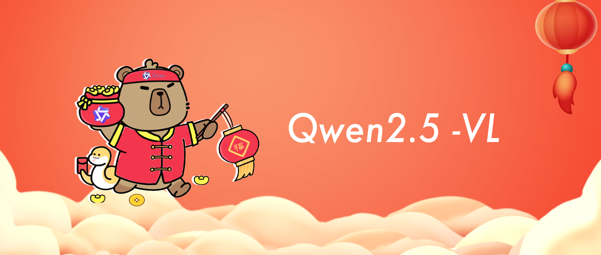
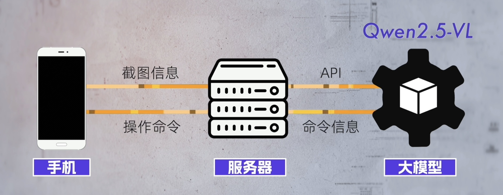

# Qwen2.5-VL agent demo


## 实现原理


1. 获取手机截图信息，并上传到服务器
2. 服务器处理图片信息，通过API提交给Qwen2.5-VL模型
3. Qwen2.5-VL识别图片，并以JSON格式返回操作信息和操作位置
4. 服务器以adb命令执行对应操作


## 2、adb连接

**通过ppadb连接第三方库**

```python
from ppadb.client import Client as AdbClient

def get_client():
    print('正在连接手机')
    client = AdbClient(host="127.0.0.1", port=5037)
    device = client.devices()[0]
    print('连接手机成功')
    return device
```


##  3、处理器

通过modelscope下载模型，加载数据处理器

```python
from modelscope import snapshot_download
from transformers import AutoProcessor
def get_processor():

    model_path = snapshot_download(
        # 模型仓库地址
        repo_id='Qwen/Qwen2.5-VL-7B-Instruct',
        # 模型安装路径
        cache_dir='')

    # 加载处理器
    processor = AutoProcessor.from_pretrained(model_path)
    return processor
```

## 4、Qwen2.5-VL工具
在MobileUse类中传入连接对象，在_key等私有方法中调用adb命令，实现对手机的操作
```python
def __init__(self, cfg=None,device=None):
    self.display_width_px = cfg["display_width_px"]
    self.display_height_px = cfg["display_height_px"]
    self.device = device
    super().__init__(cfg)

def _key(self, text: str):
        command = "input keyevent {}".format(text)
        self.device.shell(command)
```

## 5、图片信息处理和调用模型
对图片进行预处理，并调用模型，返回操作信息和操作位置
```python
# 图像信息处理.
dummy_image = Image.open(screenshot)
resized_height, resized_width  = smart_resize(dummy_image.height,
    dummy_image.width,
    factor=processor.image_processor.patch_size * processor.image_processor.merge_size,
    min_pixels=processor.image_processor.min_pixels,
    max_pixels=processor.image_processor.max_pixels,)
mobile_use = MobileUse(
    cfg={"display_width_px": resized_width, "display_height_px": resized_height}, device=device
)
```
```python
# 构建message
system_message = NousFnCallPrompt.preprocess_fncall_messages(
    messages=[
        Message(role="system", content=[ContentItem(text="You are a helpful assistant.")]),
    ],
    functions=[mobile_use.function],
    lang=None,
)

system_message = system_message[0].model_dump()
messages=[
    {
        "role": "system",
        "content": [
            {"type": "text", "text": msg["text"]} for msg in system_message["content"]
        ],
    },
    {
        "role": "user",
        "content": [
            {
                "type": "image_url",
                "min_pixels": processor.image_processor.min_pixels,
                "max_pixels": processor.image_processor.max_pixels,
                # Pass in BASE64 image data. Note that the image format (i.e., image/{format}) must match the Content Type in the list of supported images. "f" is the method for string formatting.
                # PNG image:  f"data:image/png;base64,{base64_image}"
                # JPEG image: f"data:image/jpeg;base64,{base64_image}"
                # WEBP image: f"data:image/webp;base64,{base64_image}"
                "image_url": {"url": f"data:image/png;base64,{base64_image}"},
            },
            {"type": "text", "text": user_query},
        ],
    }
]
completion = client.chat.completions.create(
    model = model_id,
    messages = messages,
)     
```

## 6、操作手机
模型输出信息处理并执行对应操作
```python
output_text = completion.choices[0].message.content
action = json.loads(output_text.split('<tool_call>\n')[1].split('\n</tool_call>')[0])
if not action['arguments'] == 'terminate' :
    mobile_use.call(action['arguments'])
    time.sleep(5)
```
# 更多内容,请关注[通义千问Qwen cookbooks](https://github.com/QwenLM/Qwen2.5-VL/tree/main/cookbooks)

